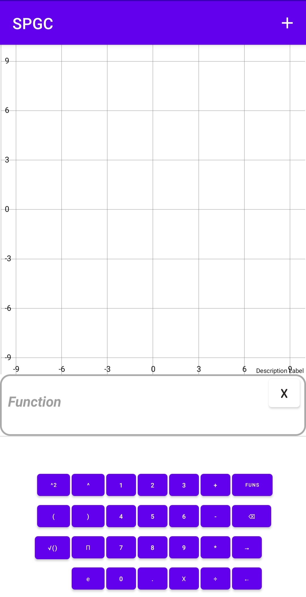
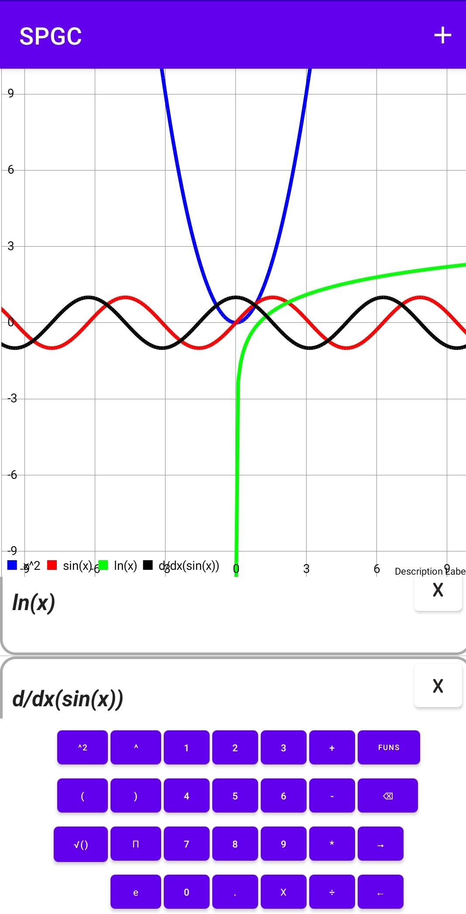
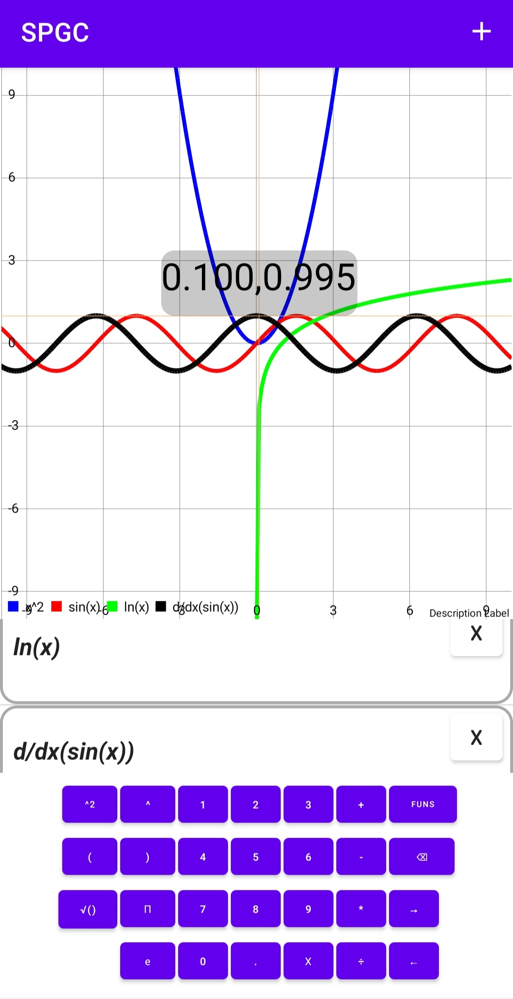

# SPGC
A simple android app for graphing mathematical functions
And parsing mathematical expressions
It's full name is simple purpose graphing calculator
The main focuses of the app are simplicity and good performance

the main layout for the app 

you can graph simple mathmatical functions like x^2 and sin(x) and combine these to get more complicated expression ,
you can graph the derivative of a function and you can also get the numerical value ,
of a definite integral of a function.

you can highlight a function value at a specific input

